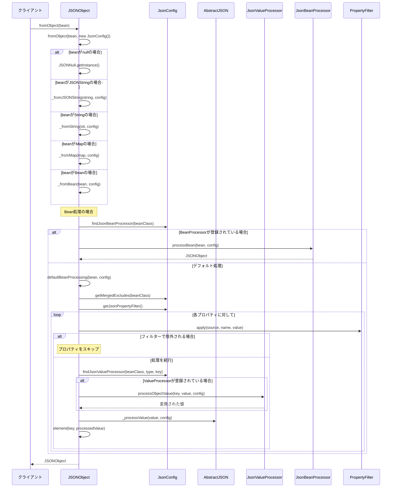
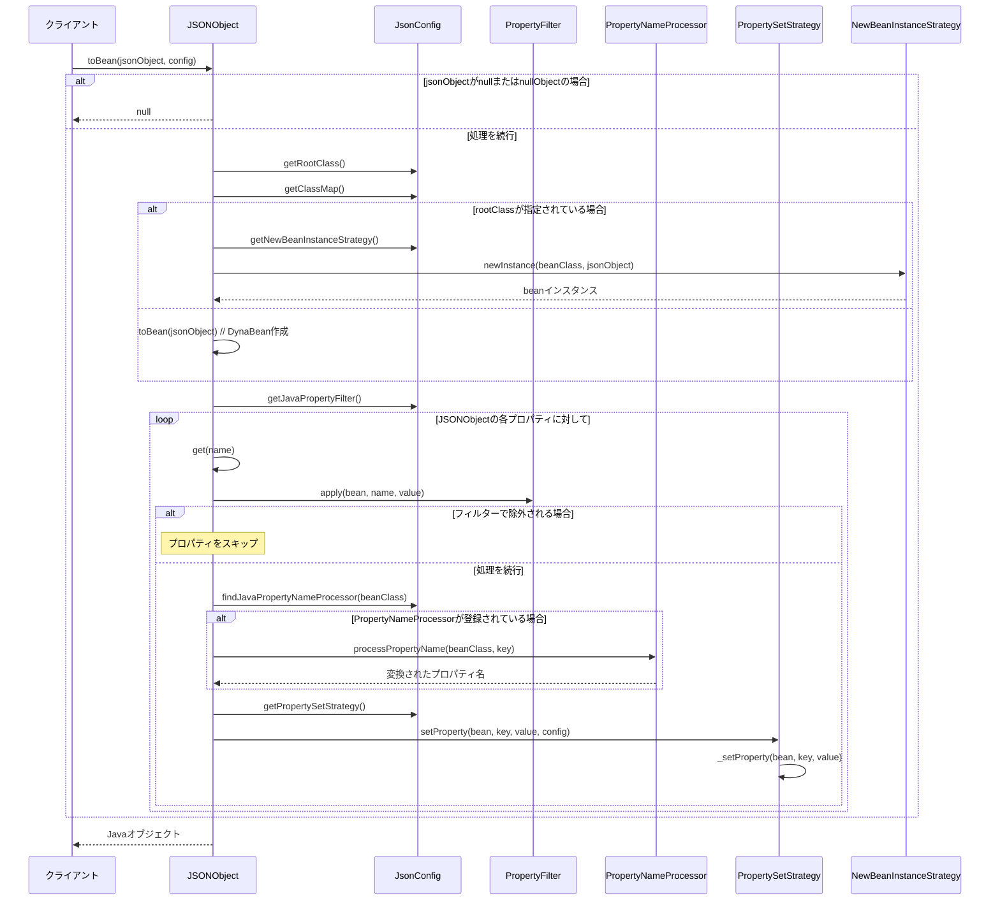
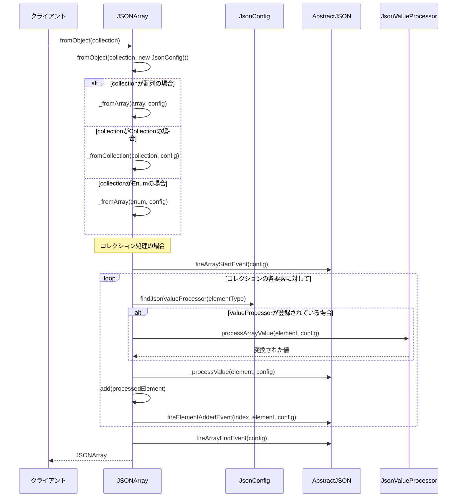
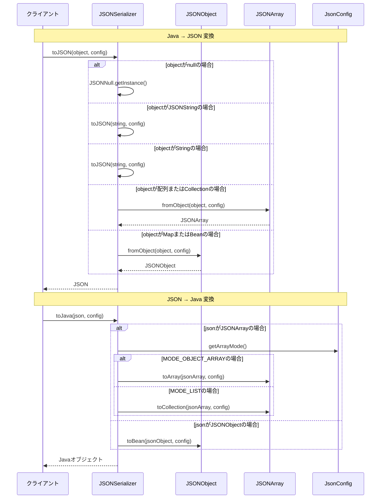
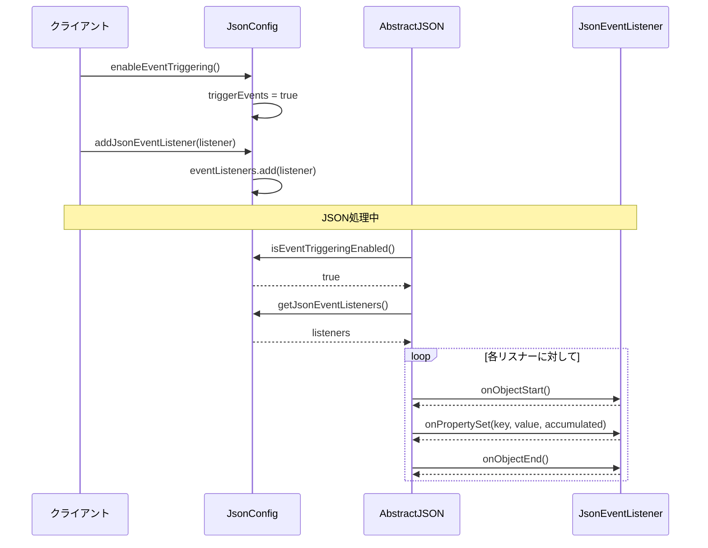

# json-lib-2.4

コアJSON型: JSONObject、JSONArray、JSONNullがJSONの基本型を表現 
設定管理: JsonConfigでシリアライゼーション/デシリアライゼーションの動作を制御 
プロセッサーシステム: カスタム変換ロジックを実装するための各種プロセッサー 
フィルターシステム: プロパティの除外や変換を制御するフィルター 
イベントシステム: シリアライゼーション過程でのイベント通知 
柔軟な変換: JavaオブジェクトとJSON間の双方向変換をサポート 
このライブラリは、JavaオブジェクトとJSON間の変換を非常に柔軟かつ設定可能な形で提供しています。 

主要クラスの処理のシーケンス図
1. JavaオブジェクトからJSONObjectへの変換シーケンス

2. JSONObjectからJavaオブジェクトへの変換シーケンス

3. JSONArrayの処理シーケンス

4. JSONSerializerの統合シーケンス

5. イベント処理シーケンス

これらのシーケンス図は、json-lib-2.4の主要な処理フローを示しています：
Java→JSON変換: オブジェクトの型に応じた適切な処理とプロセッサーの適用
JSON→Java変換: 設定に基づく適切なJavaオブジェクトの生成
配列処理: コレクションや配列のJSONArrayへの変換
統合処理: JSONSerializerによる統一的な変換インターフェース
イベント処理: 処理過程でのイベント通知システム